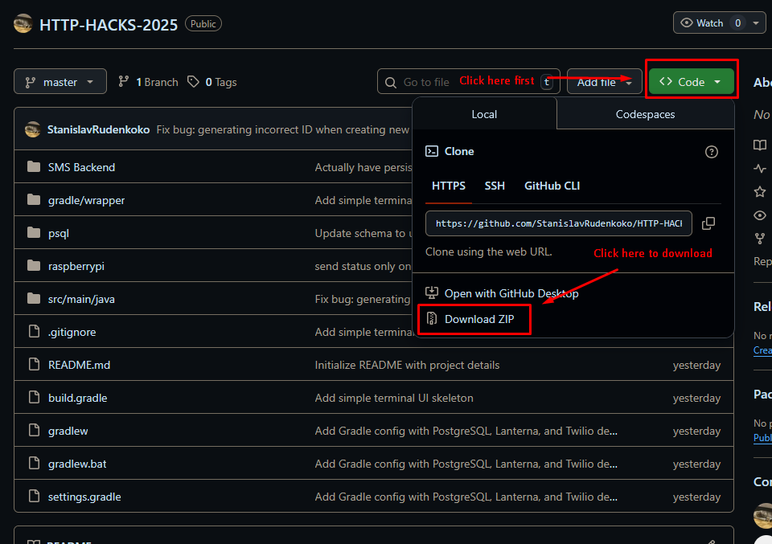
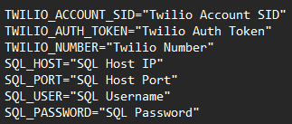

# 🗑️ The Filled Unit Notifier (FUN)

The **Filled Unit Notifier (FUN)** is a smart trash management system that helps janitorial staff monitor, reset, and receive updates on trash bin levels in real time.
Built for **BCIT**, this project combines **IoT hardware**, **Flask backend**, and **SMS integration** to make waste tracking simple, efficient, and automated.

---

## 📖 Overview

FUN makes it easier to know when trash bins are full — without manually checking them.
Each bin uses a **Raspberry Pi** and **ultrasonic sensor** to measure fill levels and send automatic updates to a **Flask server**.
Janitors can reset bins with a button press and receive real-time notifications through text messages.

This system is designed for **BCIT Secure** and **Tall Timbers Wi-Fi** networks.

---

## 🧰 Installation Guide

Follow these steps carefully — you don’t need any programming knowledge to get started. These steps are made for Windows computers, but may be adapted for other systems.

---

### 💻 Step 1: Flask & Backend Setup

**!! Only do this step if an admin has not yet set it up for your network !!**

##### **Setting up the code and environment variables**

**Download the repository and setup .env file**

1. Download the repository
   
2. Extract the files to a memorable location, such as your Documents folder
3. Open the folder, and navigate to the "SMS Backend" directory
4. Create a new file named ".env" without quotes, and make sure there is no other file extension
5. Open the .env file using any text editor

**Twilio:**

1. Create an account on [Twilio](https://www.twilio.com/try-twilio)
2. Locate your Account SID, Auth Token, and Twilio Phone number located at the bottom of the page
3. Create 3 new entries in your .env file named TWILIO_ACCOUNT_SID, TWILIO_AUTH_TOKEN, and TWILIO_PHONE_NUMBER, and copy your data into those entries

**PostgresSQL**

1. Follow [this guide](https://www.instaclustr.com/education/postgresql/postgresql-tutorial-get-started-with-postgresql-in-4-easy-steps/#sec-3) to setup a Postgres SQL server, making sure to remember your host, port, username, and password for the server
2. Create 4 new entries in your .env file named SQL_HOST, SQL_PORT, SQL_USER, and SQL_PASSWORD, and put your data into those entries
3. Within your newly created database, run the schema.sql file located in the "psql" directory in this repository
4. Optionally, run the seeding.sql file if you do not already have data for your database (this is only for testing purposes, all data can be cleared once everything is setup)

In the end, your .env file will look something like this:



##### **Running the Flask Server**

1. Install Python from the [Microsoft Store](https://apps.microsoft.com/detail/9pnrbtzxmb4z?hl=en-US&gl=US) or from [Python&#39;s website](https://www.python.org/downloads/)
2. Open the terminal and change directory into the "SMS Backend" folder
3. Run ``pip install -r requirements.txt``` and wait for the installer to finish
4. To start the server, run ``flask run`` in the terminal

---

### 🗑️ Step 2: Setting Up the Trash Bin

You’ll be provided with a trash bin that already has all software, sensors and hardware installed, including:

- **A Raspberry Pi with Code Installed**
- **Ultrasonic Sensor**
- **Red LED indicator**
- **Reset Button**

#### 🔧 Resetting the Bin

1. After you empty the trash, **press the button once.**
2. Wait for a second, then **press the button again.**
3. Look for the **red LED light** — if it **turns off and then back on**, the reset worked.
4. The bin is now ready for use again.

> 💡 Tip: You’ll hear a small click each time you press the button — that’s normal!

---

### 📱 Step 1: Using the SMS Command System

The system is controlled entirely through **text messages** — no app or software needed.

#### 📩 Getting Started

1. Text the system phone number provided to you.
2. To see all available commands, text **`F`**.
   You’ll receive a message listing every command you can use.

#### 💬 Common Commands

| Command                  | Description                              | Example              |
| ------------------------ | ---------------------------------------- | -------------------- |
| `F`                    | Lists all available commands             | `F`                |
| `subscribe bin [ID]`   | Subscribes to updates for a specific bin | `subscribe bin 3`  |
| `status bin [ID]`      | Shows whether the bin is full or empty   | `status bin 3`     |
| `list [building_name]` | Lists all bins in a specific building    | `list talltimbers` |

- In **demo mode**, updates are sent **every 20 seconds**.
- In **production**, updates are sent **every 20 minutes**.

---

---

### 🧹 Step 3: Resetting After Trash Collection

When janitors empty a bin, they must reset it so the system knows it’s empty.

#### 🔁 Reset Process

1. Locate the **reset button** under the bin lid.
2. **Press it once**, wait for a click.
3. **Press it again**, wait for another click.
4. The **red LED** will flash to confirm the reset.
5. Wait about **20 seconds**, then text:
   The reply should say the bin is **empty (0)**.

---
